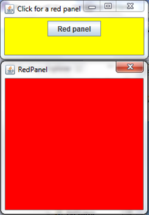

Buttons
===

In our next application, the buttons application, we have to be able to receive user input i.e. button presses. We will use the `JButton` class. The imports required for this application will be:

```java
import java.awt.FlowLayout;
import java.awt.event.ActionEvent;
import java.awt.event.ActionListener;
import javax.swing.JFrame;
import javax.swing.JButton;
import javax.swing.JLabel;
```

Here is the code, copy it:

```java
public class Buttons extends JFrame implements ActionListener {
    JButton btn1 = new JButton("Button 1");
    JButton btn2 = new JButton("Button 2");
	JLabel label = new JLabel("No buttons have been clicked", JLabel.CENTER);

    public static void main(String[] args) {
       new Buttons();
    }

    public Buttons() {
        btn1.addActionListener(this);
	    btn2.addActionListener(this);

        add(btn1);
	    add(btn2);
	    add(label);

        setLayout(new FlowLayout());
	    setSize(300, 100);
	    setTitle("Buttons");
	    setVisible(true);
	    setDefaultCloseOperation(EXIT_ON_CLOSE);
	}

    public void actionPerformed(ActionEvent e) {
        if(e.getSource() == btn1) {
            label.setText("btn1 was clicked");
        } else if(e.getSource() == btn2) {
            label.setText("btn2 was clicked");
        }
    }
}
```

Notice the `implements ActionListener`. Don't worry about that now. Just think of it as a different kind of `extends`. Rather than inheriting all the methods of the class in front of it, `implements` means that the class will contain the methods mandated by the thing in front of it. In this case it is the `actionPerformed()` method, which you do not call. By setting the ActionListener of `btn1` and `btn2` to `this` i.e. the current instance of `Buttons`, you are saying whenever `btn1` or `btn2` are clicked, you want them to pass on the event to the current instance of `Buttons`. The `e` variable stores information about the event. `getSource()` will return the button that was pressed.

Finally, the `setText()` method on the label allows you to dynamically change the text.

These are what should be outputted at the start; when the first button is clicked; and when the second button is clicked:


### Ex 1
Use what you have been taught here to create a random number generator that generates a number between 1 to 100.

## Adding Images
These buttons are all well and good, but to be honest, they don't look very good. For that reason, it's time to find out how to add images to buttons. You do this in much the same way that you add images to labels, using ImageIcons. So, to do this you would include the following code:

```java
ImageIcon image = new ImageIcon("cute cat picture.jpg");

button = new JButton(image);
```

Doing this will set the button to have an image on it instead of text. Add a panel and a text field (you will learn about these later), and you can get something like this:


And yes, you have permission to scream 'CUUUUUUUUTTTTEEEEE' in a very high-pitched voice. 

### Ex 1 
Make a JButton yourself. Have it change a label from "No buttons pressed" to "The button has been pressed" using the ActionListener. If, you want a challenge, add more than one button or make them contain pictures.

N.B. not all pictures require a tag of 'cute'.

## JRadioButtons
A radio button is a button that you often see on multiple choice quizzes, the ones that are circular and fill in when you click them. To create these you have to use `JRadioButtons`, which work exactly the same as normal buttons. To create one you would have to do this:

```java
JRadioButton btn1 = new JRadioButton("One");
//where "One" is the label of the button.
```

Adding this to the JFrame will create a radio button. These buttons also interact with ActionListener. However, what use would a radio button be if you could click more than one at the same time? Anything that requires only one option being selected would be broken. To fix this you have to add the buttons ot a `ButtonGroup`. This makes sure that only one option works at a time. The following code would be used:

```java
ButtonGroup buttons = new ButtonGroup();
```

to create the buttongroup, and then:

```java
buttons.add(btn1);
```

in the constructor to add the button to the button group.Therefore the following would be outputted:


### Ex 2
Make 3 radio buttons with different names of subjects (History, Computing, Maths etc.) and have a JLabel ask which is the user's favourite. Also have the JLabel respond to that with an appropriate message.

## JCheckBoxes
Check boxes are exactly the same a radio buttons, only look slightly different. These, instead of becoming a filled circle upon  being clicked, become a ticked box. To use these you will require a ButtonGroup, as before, and to import JCheckBoxes. These also interact with ActionListeners. The code for these is pretty intuitive, but I'll display it anyway:

```java
JCheckBox one = new JCheckBox("Noodles");
```

Using these you can create things like the following:


### Ex 3
Create 3 check boxes with custom names, and use ActionListener to display an appropriate message depending on which box has been checked.

## Calling another class
Another thing you can do with a button is display another frame on screen when it is clicked. So, for example, if I wanted a red panel to appear whn I clicked a button, what should I do? Well, the first thing is to create the button and add an ActionListener, but that goes without saying. What you have to do beyond that is something like the following:

```java
btn1.addActionListener(new ActionListener () {
	public void actionPerformed(ActionEvent e) {
		redpanel red = new redpanel();
		red.setVisible(true);
	}
});
```

That code will call another class, or another file in the same folder to put it in other words, and set it to be visible. This particular file is called `redpanel`, and I gave it the identifier `red`. However, this file needs to exist, and it can be like the following:

```java
public class RedPanel extends JDialog {

	public RedPanel() {
		setSize(200,200);
		setVisible(true);
		getContentPane().setBackground(Color.RED);
		setDefaultCloseOperation(DISPOSE_ON_CLOSE);
		setTitle("RedPanel");
	}
}
```
 The astute will notice two things different with this. 1) There is no main method. This is because it is being called from another class, so that main method was the first to be looked at by the computer. Therefore it is not needed. 2) The class extends `JDialog`, not JFrame. This is just something that you have to accept - a JFrame would not work, so we use JDialog. Using this something like this can be made:
 


[I hope you've been listening - we've got a challenge coming up &rarr;](./Part IV: Temperature.html)
