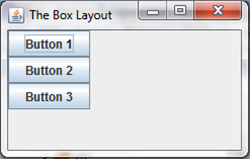
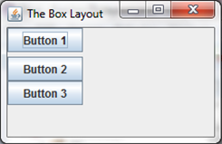
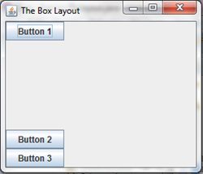
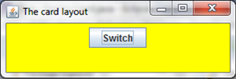
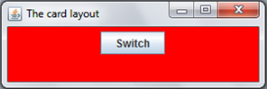
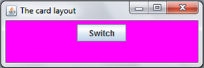
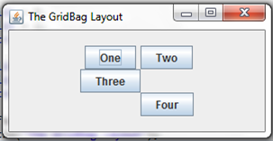
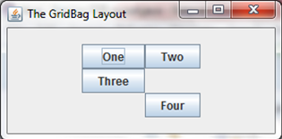
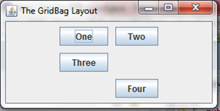
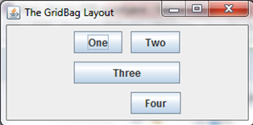

Layouts
===

Basically, a **layout manager** is a way of presenting and displaying the elements of either a frame or a panel. In other words, layouts allow you to tell the computer where you want to display your different objects and in what order. As we have seen previously, you  apply the layouts to a frame. In Java, there exists many different types of layouts, four of which are: the grid layout, the flow layout, the box layout and the border layout.

## The Flow Layout
Flow Layout, which is the only layout manager you have seen before, is the simplest layout you can choose because it arranges the components one after another, going from left to right, in the order in which you add them.

```java
import java.awt.FlowLayout;
//you will have to do this for the other layouts using their respective imports

import javax.swing.JButton;
import javax.swing.JFrame;

public class FloLayout extends JFrame{
	JButton btn1 = new JButton("Component 1");
	JButton btn2 = new JButton("Component 2");
	JButton btn3 = new JButton("Component 3");
	
	public FloLayout() {
		setLayout(new FlowLayout());
		add(btn1);
		add(btn2);
		add(btn3);
		
		setTitle("The Flow Layout");
		setDefaultCloseOperation(EXIT_ON_CLOSE);
		pack();
		//makes sure that the window is as big as the space taken up by the buttons 
		setVisible(true);
	}
	
	public static void main(String[] args) {
		new FloLayout();
	}
}

```

This displays elements of a frame so that `component1` (which has already been initialised) comes before `component2` (which has also been initialised). It should therefore look something like this:


###Ex 1
Create a frame using three buttons that are oriented using the flow layout. Use the syntax above. It should therefore look like this:


## The Border Layout


A border layout allows you to place your elements into five different regions as shown above. You can use relatively the same code as you did for the flow layout, but bear in mind that you must give the component the name NORTH, SOUTH etc.  

```java
//this is what the buttons should look like, respective of their positions
JButton component1 = new JButton("NORTH");

setLayout(new BorderLayout());
add(component1, BorderLayout.NORTH);
add(component2, BorderLayout.SOUTH);
add(component3, BorderLayout.EAST);
add(component4, BorderLayout.WEST);
add(component5, BorderLayout.CENTER);
```

###Ex 2
Create a frame with five buttons that are oriented using the border layout. You will have to do this yourself. For reference however, the end product should look like this:


##The Grid Layout
A Grid Layout arranges the components into a two dimensional grid with a number of rows and columns.

```java
setLayout(new GridLayout(2, 3));
// the different values are as follows: number of rows; and number of columns.
```

OR

```java
setLayout(new GridLayout(2, 3, 3, 5));
// the different values are as follows: number of rows; number of columns; horizontal padding and vertical padding.
```

This creates a layout with two rows and three columns as seen below:


###Ex 3
Create a frame with six buttons that are oriented using the grid layout. You will once again have to do this yourself. This is what the end product should look like:


## The Box Layout
The Box Layout us basically a better flow layout, because the flow layout allows for horizontal alignment of components whereas the box layout allows for that, horizontally aligned components and a better manipulation of these components. To use this layout you will need a panel and some buttons, or other components. You then have to use the following code:

```java
panel.setLayout(new BoxLayout(panel, BoxLayout.PAGE_AXIS));
//where panel is the name of a JPanel
panel.add(btn1);
panel.add(btn2);
panel.add(btn3);
add(panel);
```

The first line is the important one when using the Box Layout. You set the layout to the panel, as with all the others, but the contents of the parameters is what's important. The first word is the parent component i.e. the panel. Then the `BoxLayout.PAGE_AXIS` sets the components to be aligned vertically, which is one of the reasons the box layout is better than the flow layout. However if you do want to align the components horizontally, you just replace `PAGE_AXIS` with `LINE_AXIS`. Anyway, using the code above, you create something like this:



But this is not the extent of the box layout. The first thing that we can do is separate the components. To do this you have to use the following code:

```java
panel.add(Box.createRigidArea(new Dimension(0,5)));
```

This will separate the two components that it is placed in between with a gap of '5', which can be interpreted as 5px. This is created by the `new Dimension(0,5)`, which would be replaced by `new Dimension(5,0)` if you were using the `LINE_AXIS`. The separation looks like this:



One final thing that you can do with the box layout is 'glue' the components to the top or bottom of the frame. To use this you will need the following:

```java
panel.add(Box.createVerticalGlue());
```

This is placed between the first and second button, and it is a vertical glue, which, quite literally, glues everything after the first button to the bottom. If you wanted to use this with a `LINE_AXIS` then you will simply have to use this:

```java
panel.add(Box.createHorizontalGlue());
```

The vertical glue will create the following layout:



## The Card Layout
At the beginning of this part I mentioned four basic layouts, but they are not the only ones. The next to look at is the `CardLayout`. This layout allows for two panels to occupy the same place. This is not the only way, but is the best. As a point of reference, the least experienced will use JFrames, the more experienced will use JTabbedPanes (which you will experience in Complex Interfaces) but the best will use this. To use a card layout, you have to actually declare and instantiate it - which is brand new for a layout. As a reminder:

```java
CardLayout cl = new CardLayout();
```

So, to use the card layout, you ahve to have a few things. Firstly, you need the panels, but you need one more than you will be showing. In other words, if you plan to house three panels in the same place, you need to declare four. This fourth extra panel is the container for all the other panels. Once you have that, you need the components to put in the panels, and I will be using buttons so I can change the panels. Then you will need the following code:

```java
cont.add(panel1, "1");
//'cont' is the container panel, 'panel1' is the panel's name and '"1"' is the identifier for the card layout.
cont.add(panel2, "2");
cont.add(panel3, "3");
cl.show(cont, "1");
//the card layout will show the container panel with the panel with the identifier '"1"' first.
```

Once you have that, you have to actually make the buttons switch the panels. So, add ActionListeners to each, and use the following code, which includes the `show()` method:

```java
btn1.addActionListener(new ActionListener() {
    public void actionPerformed(ActionEvent e) {
	cl.show(cont, "2");
	//show the second
    }
});
```

This is for the first button which, when pressed, will show the second panel. This is easily replicable by simply including the container panel (otherwise known as the parent component) and the identifier of the panel. You can create something like this using this, and you'll just have to believe me that this was all done at once using the same space.





## The GridBagLayout
Now, onto the most powerful, and most weirdly named, layout, the GridBagLayout. This is, most definitely, the most powerful layout, and it sets the frame up as a grid, like a gridlayout but gives far more adaptability. Before we get ahead of ourselves however, we have to know how to use the basics of this layout. First you have to set the layout to be `GridBagLayout()`, but you also have to declare the following:

```java
GridBagConstraints gc = new GridBagConstraints();
```

You will have to remember `gc` because that is what you manipulate and then you add he components to that. Bear in mind that `gc` is just an identifier, so you can replace it with anything. So, for example, if I had 4 buttons and wanted to have 2 on the top row, 1 on the middle-left and 1 on the bottom-right, I would use the following:

```java
gc.gridx = 0;
gc.gridy = 0;
add(btn1, gc);

gc.gridx = 1;
gc.gridy = 0;
add(btn2, gc);

gc.gridx = 0;
gc.gridy = 2;
add(btn3, gc);

gc.gridx = 1;
gc.gridy = 3;
add(btn4, gc);
```

The code above should mean nothing to you but is actually very simple. I mentioned that GridBagLayout works based off of grid co-ordinates, and that is what the whole business with `gridx` and `gridy` is doing. `gridx = 0` and `gridy = 0` refers to the top left corner of the frame. Setting `gridx` to 1 would move it over one on the x axis; setting `gridy` to 1 would move it down one on the y axis. Also, it must be noted that when you add the component to the JFrame or JPanel, you must add it to the GridBagConstraints at the same time. So, instead of `add(btn4)`, you have to use `add(btn4, gc)`. It would be useful to remember that GridBagConstraints are also position-sensitive. Therefore you should add the button directly after you set the location. The fact that it is position-sensitive will become important later. Anyway, the above code will create the following:



You will notice that there are some problems with that frame. In other words, it doesn't look good. The first thing to do is to fix the differing sizes of the buttons. You can do this using `.fill`. To use this you need to do the following;

```java
gc.fill = 1;
//forces the components to fill the grid spaces they are assigned to

gc.fill = GridBagConstraints.VERTICAL;
//forces the components to be the same height

gc.fill = GridBagConstraints.HORIZONTAL
//forces the components to be the same width
```

Using either the top one or the bottom two, you can fix the button size and make it look like the following picture:



Now, I've decided that I don't want all the buttons to be touching eachother, but I still want them to be the same size. So, I can use `.insets`:

```java
gc.insets = new Insets(5,5,5,5);
//5,5,5,5 means 5 pixels of padding on each side
```

The following layout of buttons are therefore created:



And finally, I've now decided that I want the third button to be the size of two buttons lengthwise. Therefore I will need it to fill up two columns. To do this you need to set the width of the component (or indeed the height if you want the buttons or component to span rows) :

```java
gc.gridwidth = 2;
//sets the width of the component to be 2 columns

gc.gridheight = 2;
//I didn't use this, but would set the height of the component to be 2 rows.
```

Finally, and I prefer this layout of buttons to the first time we used GridBagLayout, this is what a combination of the above can acheive:



[We've made passing mentions, but now it's time to study JTextFields in full &rarr;](./Part VI: Text Fields.html)
